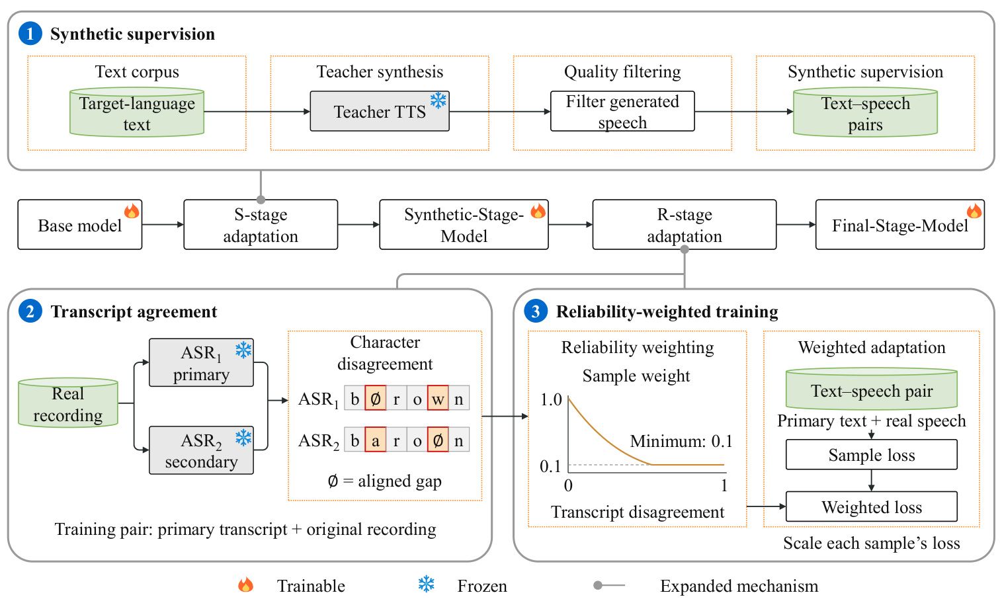

<h1 align="center">From Reliable Text to Real Voices</h1>

<h3 align="center">Trust-Aware Progressive Adaptation<br>for Low-Resource TTS</h3>

<p align="center"><strong>S2R-Adaptation-TTS · Burmese & Lao · FireRedTTS3 & OmniVoice</strong></p>

<p align="center">
Jiayi Lu<sup>1,2,*</sup> · Yizhong Geng<sup>1,3,*</sup> · Jinghan Yang<sup>3</sup> · Lexing Huang<sup>4</sup> · Boxun An<sup>5</sup> · Yingming Gao<sup>3</sup> · Ya Li<sup>3,†</sup>
</p>
<p align="center">
<sup>1</sup> Beijing Logic Intelligence Technology &nbsp; <sup>2</sup> University of Washington<br>
<sup>3</sup> Beijing University of Posts and Telecommunications<br>
<sup>4</sup> University of California, USA &nbsp; <sup>5</sup> Northwestern University, USA<br>
<sub>* Equal contribution &nbsp; † Corresponding author</sub>
</p>

<p align="center">
  <a href="https://insiderx-pro.github.io/S2R-Adaptation-TTS/"></a>
  <a href="#paper-and-citation"></a>
  <a href="https://huggingface.co/joa8115/S2R-Adaptation-TTS"></a>
  <a href="https://github.com/InsiderX-Pro/S2R-Adaptation-TTS"></a>
</p>

<p align="center">
<a href="#method">Method</a> · <a href="#paper-results">Results</a> · <a href="#listen-and-compare">Audio</a> · <a href="#model-weights">Weights</a> · <a href="#getting-started">Get started</a>
</p>

---

**Learn pronunciation from synthetic speech. Recover speaker control with real voices.**
S2R-Adaptation-TTS studies how the order and reliability of weak supervision shape
low-resource speech synthesis. Synthetic pairs establish text–speech correspondences;
real recordings then recover speaker conditioning. Agreement between two fixed ASR
systems controls each real example's training weight, while the primary transcript
remains unchanged.

## Method

<p align="center">

</p>

| Stage | Supervision | What it learns |
| :--- | :--- | :--- |
| **01 · Synthetic** | Filtered teacher-generated pairs; unit sample weights | Target-language pronunciation and text–speech correspondence |
| **02 · Agreement** | Two ASR transcripts of the same real recording | Reliability from normalized character disagreement |
| **03 · Real** | Original audio and primary transcripts; cubic weights | Reference-speaker control with less influence from uncertain labels |

```text
weight = max(0.10, (1 − min(transcript_disagreement, 1))³)
loss   = sum(weight × complete_sample_loss) / number_of_examples
```

Architectures and objectives stay unchanged. Optimizers and schedules restart
between stages. Offline ASR scoring adds no inference-time ASR.
Agreement is informative, but does not prove transcript correctness.

## Paper Results

**Cubic S→R** has the highest observed joint score H and mean naturalness MOS in
all three evaluated settings. These are the paper's main experiments.

| Backbone / language | CER (%) ↓ | SIM-O ↑ | H ↑ | Naturalness MOS ↑ |
| :--- | ---: | ---: | ---: | ---: |
| FireRedTTS3 · Burmese | 16.90 ± 0.26 | 0.6997 ± 0.0016 | **75.97** | **4.12** [3.93, 4.30] |
| FireRedTTS3 · Lao | 13.97 ± 0.36 | 0.6968 ± 0.0045 | **77.00** | **3.97** [3.77, 4.17] |
| OmniVoice · Burmese | **6.85 ± 0.08** | 0.7098 ± 0.0026 | **80.57** | **4.51** [4.35, 4.66] |

CER and SIM-O: mean ± sample SD over seeds 42/17/73. MOS: mean [approximate
95% crossed-bootstrap CI], with 20 listeners × 30 matched conditions per language.
Numerical rankings do not establish significance: only the FireRedTTS3/Burmese
paired cubic-minus-uniform-0.5 MOS interval excludes zero.

<details>
<summary><strong>Independent ASR and evaluation details</strong></summary>

| Cubic S→R setting | Independent recognizer | CER (%) ↓ |
| :--- | :--- | ---: |
| FireRedTTS3 · Burmese | Dolphin-small | 19.34 |
| FireRedTTS3 · Lao | XLS-R Lao | 18.53 |
| OmniVoice · Burmese | Dolphin-small | 9.83 |

These recognizers rescore the same audio and target texts. They were excluded
from labeling, reliability estimation, filtering and model selection.
Burmese uses Common400 CER / Clone300 SIM-O; Lao uses FLEURS404.
OmniVoice Base has 10.35% CER; cubic improves it by 3.50 points.
Compare CER within the same language and recognizer.

[All strategies, baselines and ablations →](https://insiderx-pro.github.io/S2R-Adaptation-TTS/#results)

</details>

## Listen and Compare

Open the **[interactive audio comparisons](https://insiderx-pro.github.io/S2R-Adaptation-TTS/#audio)**
to hear the same text and reference voice across adaptation strategies.

| Language | Included comparisons |
| :--- | :--- |
| **Burmese** | OmniVoice Base; FireRedTTS3 S, R, R→S and cubic S→R |
| **Lao** | FireRedTTS3 S, R, R→S and cubic S→R |

[Download all 11 WAV files](docs/assets/selected-audio.zip) · [Audio metadata](docs/assets/demo-data.json)

## Model Weights

**[Hugging Face · joa8115/S2R-Adaptation-TTS](https://huggingface.co/joa8115/S2R-Adaptation-TTS)**

| Checkpoint | Backbone | Format | Adaptation |
| :--- | :--- | :--- | :--- |
| `omni_common400/checkpoint-200` | OmniVoice · Burmese | Native routed LoRA; rank 8 / alpha 16 | Common400 continuation, 200 steps, uniform weight 0.5 |

This checkpoint was continued on Common400 itself. Any evaluation on that set is
**in-sample**; this artifact is separate from the paper's cubic main-result models.
It requires the matching OmniVoice base and native routed adapter loader,
not a generic PEFT loader. See the Hugging Face model card for usage.

## Getting Started

| Task | Start here |
| :--- | :--- |
| Install, train and export | [Training guide](TRAINING.md) |
| Process real audio and pair references | [Video preprocessing](video_data_pipeline/README.md) |
| Join ASR outputs and compute weights | [Reproduction workflow](REPRODUCTION.md#2-run-asr2-and-build-cubic-weights) |
| Run S→R adaptation | [Complete reproduction guide](REPRODUCTION.md) |
| Update the paper site | [Website guide](WEBSITE.md) |

<details>
<summary><strong>Repository map</strong></summary>

```text
S2R-Adaptation-TTS/
├── s2r_adaptation/       # Agreement, weighted losses and trainers
├── backbones/           # FireRedTTS3 and OmniVoice source
├── video_data_pipeline/ # Video preprocessing and quality checks
├── scripts/             # S→R training entry points
├── examples/            # Illustrative manifest records
├── tests/               # Method and training integration tests
└── docs/                # Project website, paper and audio demos
```

GitHub Pages publishes only `docs/`. The GitHub repository remains private.
Training data and base-model weights are not stored in this repository.

</details>

## Paper and Citation

**[Read the manuscript](docs/assets/paper.pdf)** · **arXiv: coming soon**

The arXiv badge is a placeholder until an identifier is available. No accepted
venue, DOI or arXiv identifier is claimed.

```bibtex
@unpublished{lu2026reliable,
  title = {From Reliable Text to Real Voices: Trust-Aware Progressive Adaptation for Low-Resource TTS},
  author = {Lu, Jiayi and Geng, Yizhong and Yang, Jinghan and Huang, Lexing and An, Boxun and Gao, Yingming and Li, Ya},
  year = {2026},
  note = {Manuscript}
}
```

## Acknowledgements and Source Scope

Built on **FireRedTTS3** and **OmniVoice**, with retained upstream licenses and
provenance in [THIRD_PARTY.md](THIRD_PARTY.md). The reference implementation
reconstructs the adaptation workflow; it does not claim byte-identical recovery
of all historical experiment code. Project-specific code licensing will be
finalized before a public code release.
